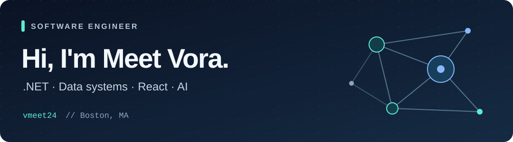

I'm a software engineer at **Philips**, based in **Boston**. I build **C#/.NET services**, data pipelines, and React tools. I also prototype AI assistants that use LLM tool calling to carry out useful tasks.

I like tracing a request all the way through a system: the API, the queue, the database, and the failure paths in between.

[LinkedIn](https://www.linkedin.com/in/meetvora1998/) · [Email](mailto:meetvora1998@gmail.com) · [Portfolio](https://vmeet24.github.io/)

## What I work on

- **Backend and data systems:** asynchronous services, event ingestion, distributed SQL, and aggregation, with attention to retries, isolation, and observability.
- **Full stack tools:** React and TypeScript interfaces backed by .NET or Express services, making technical workflows easier to operate.
- **AI prototypes:** assistants with tool calling and agentic loops, with caching, rate limits, and timeouts around their execution.

## Selected projects

### AI Stock Analyzer

*Private repository*

A **React/TypeScript** stock-analysis app with an **Express backend**, technical indicators, **Claude-assisted analysis**, and live updates over **Server-Sent Events**. Background jobs handle AI analysis, with caching and optional PostgreSQL persistence.

### [Space Station Simulation](https://github.com/vmeet24/Space-Station-Simulation)

A **C#/.NET** simulation with separate launch-vehicle and payload services, **WCF telemetry callbacks**, and a **Windows Forms** mission dashboard. Includes launch, deployment, and deorbit controls.

## Tools I use

| Area | Tools |
| --- | --- |
| Backend | C#, .NET, ASP.NET Core, Python, Node.js, Express |
| Interfaces | React, TypeScript, JavaScript |
| Data and messaging | SQL, PostgreSQL, YugabyteDB, Kafka, NATS JetStream, RabbitMQ, Protobuf |
| Cloud and delivery | AWS, Kubernetes, Helm, Argo CD, Terraform |
| AI | AWS Bedrock, Claude, LLM tool calling |

**M.S. in Computer Science, Northeastern University.**

Outside of code, I take anime recommendations seriously.
